# Mythos Atlas — Stats Dashboard

> 自動更新於 2026-06-28 12:31 UTC

---

## 專案概覽 / Project Overview

| Metric | Value |
|--------|-------|
| 文化體系 / Cultures | 44 |
| 已充實 / Enriched | 19 (43.2%) |
| 待充實 / To Enrich | 25 |
| 分析文章 / Analyses | 115 |
| 神祇頁面 / God Pages | 404 |
| 故事頁面 / Story Pages | 302 |
| 比較頁面 / Comparison Pages | 258 |
| 總頁面 / Total Pages | 964 |
| 平均每文化頁面 / Avg Pages/Culture | 21.9 |
| 內容總深度 / Total Lines | 41,417 |
| 執行次數 / Runs | 52 |

---

## 🎯 文化充實進度 / Enrichment Progress

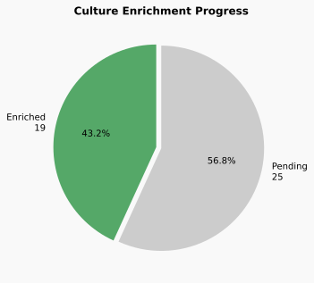

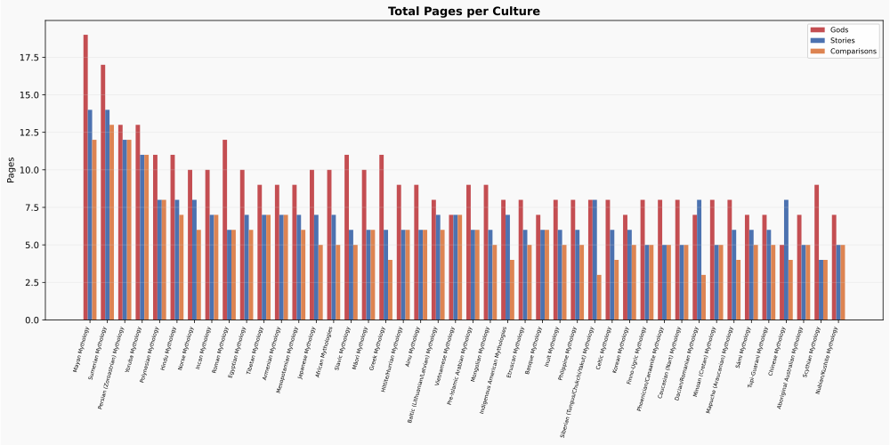

---

## 📈 分析覆蓋 / Analysis Coverage

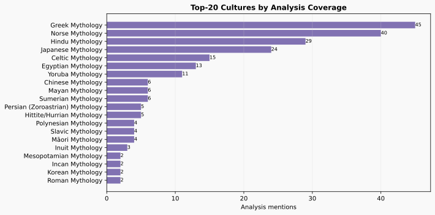

---

## 📡 各文化雷達圖 / Per-Culture Radar

五維度雷達圖：神祇頁面、故事頁面、比較頁面、充實狀態、分析提及次數。

| 文化 | 雷達圖 | 頁面總數 | 已充實 | 分析提及 |
|------|--------|---------|--------|---------|
| **馬雅神話** Mayan Mythology | 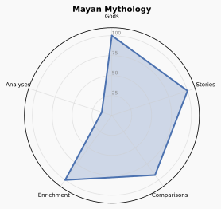 | 45 | ✅ | 6 |
| **蘇美神話** Sumerian Mythology | 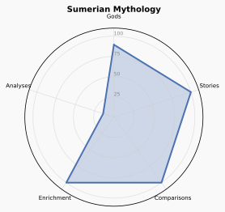 | 44 | ✅ | 6 |
| **波斯神話** Persian (Zoroastrian) Mythology | 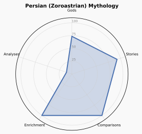 | 37 | ✅ | 5 |
| **約魯巴神話** Yoruba Mythology | 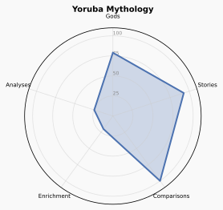 | 35 | ⬜ | 11 |
| **波利尼西亞神話** Polynesian Mythology | 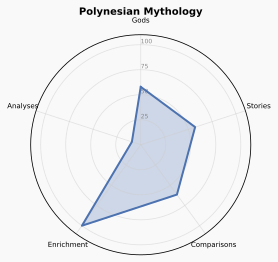 | 27 | ✅ | 4 |
| **印度神話** Hindu Mythology | 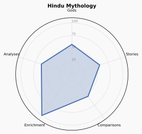 | 26 | ✅ | 27 |
| **北歐神話** Norse Mythology | 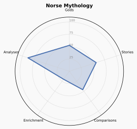 | 24 | ⬜ | 38 |
| **印加神話** Incan Mythology | 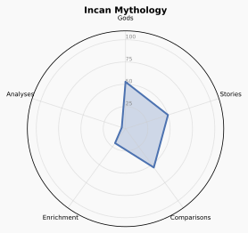 | 24 | ⬜ | 2 |
| **羅馬神話** Roman Mythology | 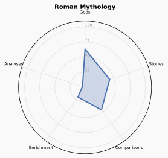 | 24 | ⬜ | 2 |
| **埃及神話** Egyptian Mythology | 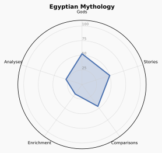 | 23 | ⬜ | 13 |
| **西藏神話** Tibetan Mythology | 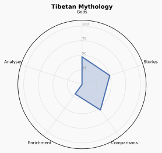 | 23 | ⬜ | 0 |
| **亞美尼亞神話** Armenian Mythology | 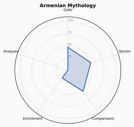 | 23 | ⬜ | 0 |
| **美索不達米亞神話** Mesopotamian Mythology | 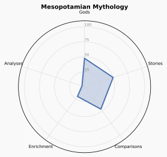 | 22 | ⬜ | 2 |
| **日本神話** Japanese Mythology | 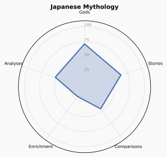 | 22 | ⬜ | 23 |
| **非洲諸神話** African Mythologies | 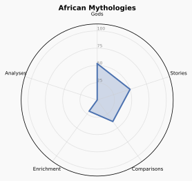 | 22 | ⬜ | 0 |
| **斯拉夫神話** Slavic Mythology | 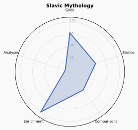 | 22 | ✅ | 4 |
| **毛利神話** Māori Mythology | 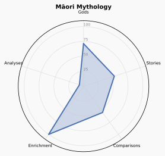 | 22 | ✅ | 4 |
| **希臘神話** Greek Mythology | 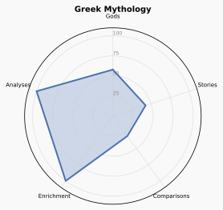 | 21 | ✅ | 43 |
| **赫梯神話** Hittite/Hurrian Mythology | 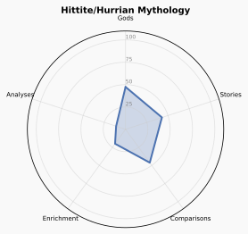 | 21 | ⬜ | 5 |
| **愛努神話** Ainu Mythology | 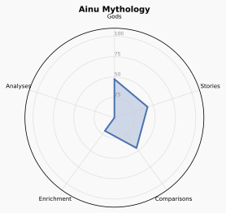 | 21 | ⬜ | 0 |
| **波羅的神話** Baltic (Lithuanian/Latvian) Mythology | 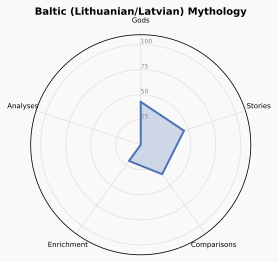 | 21 | ✅ | 0 |
| **越南神話** Vietnamese Mythology | 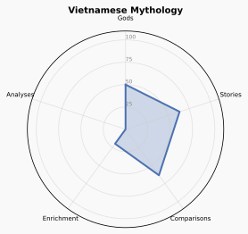 | 21 | ⬜ | 0 |
| **前伊斯蘭阿拉伯神話** Pre-Islamic Arabian Mythology | 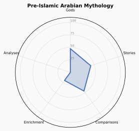 | 21 | ⬜ | 0 |
| **蒙古神話** Mongolian Mythology | 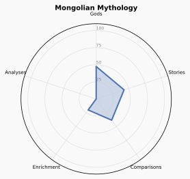 | 20 | ⬜ | 0 |
| **美洲原住民神話** Indigenous American Mythologies | 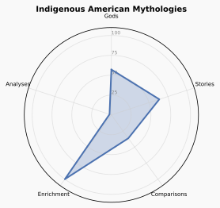 | 19 | ✅ | 1 |
| **伊特魯里亞神話** Etruscan Mythology | 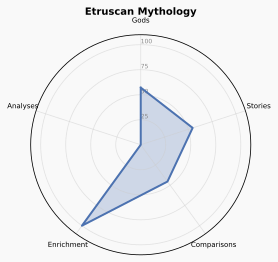 | 19 | ✅ | 0 |
| **巴斯克神話** Basque Mythology | 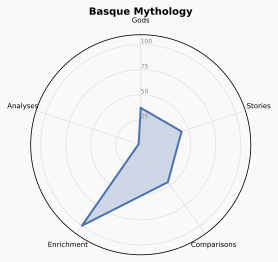 | 19 | ✅ | 1 |
| **因紐特神話** Inuit Mythology | 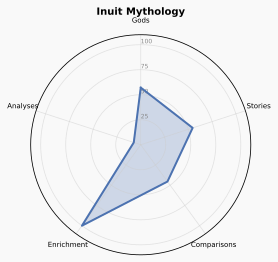 | 19 | ✅ | 3 |
| **西伯利亞神話** Siberian (Tungus/Chukchi/Yakut) Mythology | 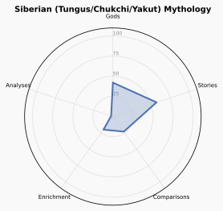 | 19 | ⬜ | 1 |
| **凱爾特神話** Celtic Mythology | 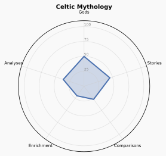 | 18 | ⬜ | 15 |
| **韓國神話** Korean Mythology | 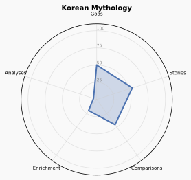 | 18 | ⬜ | 2 |
| **芬蘭-烏戈爾神話** Finno-Ugric Mythology | 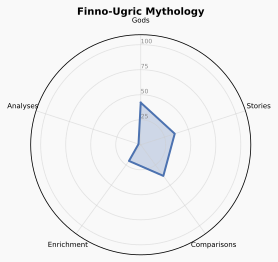 | 18 | ⬜ | 1 |
| **腓尼基神話** Phoenician/Canaanite Mythology | 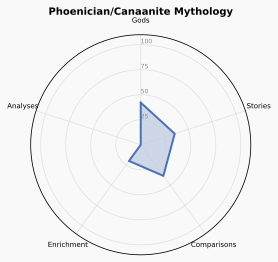 | 18 | ⬜ | 0 |
| **高加索神話** Caucasian (Nart) Mythology | 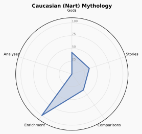 | 18 | ✅ | 0 |
| **達基亞/羅馬尼亞神話** Dacian/Romanian Mythology | 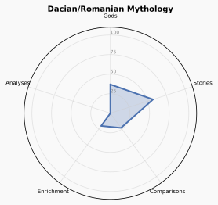 | 18 | ⬜ | 0 |
| **馬普切神話** Mapuche (Araucanian) Mythology | 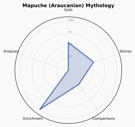 | 18 | ✅ | 0 |
| **圖皮-瓜拉尼神話** Tupi-Guarani Mythology | 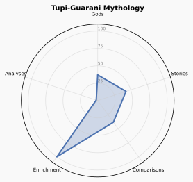 | 18 | ✅ | 1 |
| **中國上古神話** Chinese Mythology | 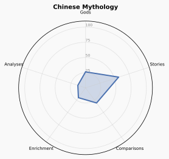 | 17 | ⬜ | 6 |
| **澳洲原住民神話** Aboriginal Australian Mythology | 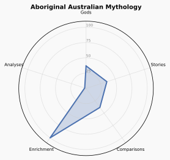 | 17 | ✅ | 1 |
| **斯基泰神話** Scythian Mythology | 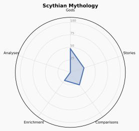 | 17 | ⬜ | 0 |
| **努比亞/庫什神話** Nubian/Kushite Mythology | 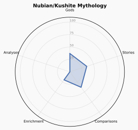 | 17 | ⬜ | 0 |
| **菲律賓神話** Philippine Mythology | 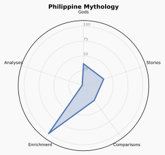 | 16 | ✅ | 1 |
| **米諾斯神話** Minoan (Cretan) Mythology | 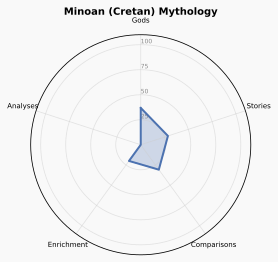 | 15 | ⬜ | 0 |
| **薩米神話** Sámi Mythology | 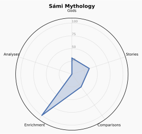 | 15 | ✅ | 0 |

---

## 📊 各文化詳細指標 / Detailed Metrics

| Culture | Gods | Stories | Comps | Total | Enriched | Analyses | Depth |
|---------|------|---------|-------|-------|----------|----------|-------|
| 馬雅神話 (Mayan Mythology) | 19 | 14 | 12 | 45 | Y | 6 | 2044 |
| 蘇美神話 (Sumerian Mythology) | 17 | 14 | 13 | 44 | Y | 6 | 2148 |
| 波斯神話 (Persian (Zoroastrian) Mythology) | 13 | 12 | 12 | 37 | Y | 5 | 2436 |
| 約魯巴神話 (Yoruba Mythology) | 13 | 11 | 11 | 35 | N | 11 | 1774 |
| 波利尼西亞神話 (Polynesian Mythology) | 11 | 8 | 8 | 27 | Y | 4 | 1425 |
| 印度神話 (Hindu Mythology) | 11 | 8 | 7 | 26 | Y | 27 | 702 |
| 北歐神話 (Norse Mythology) | 10 | 8 | 6 | 24 | N | 38 | 1017 |
| 印加神話 (Incan Mythology) | 10 | 7 | 7 | 24 | N | 2 | 1114 |
| 羅馬神話 (Roman Mythology) | 12 | 6 | 6 | 24 | N | 2 | 1066 |
| 埃及神話 (Egyptian Mythology) | 10 | 7 | 6 | 23 | N | 13 | 653 |
| 西藏神話 (Tibetan Mythology) | 9 | 7 | 7 | 23 | N | 0 | 1079 |
| 亞美尼亞神話 (Armenian Mythology) | 9 | 7 | 7 | 23 | N | 0 | 735 |
| 美索不達米亞神話 (Mesopotamian Mythology) | 9 | 7 | 6 | 22 | N | 2 | 603 |
| 日本神話 (Japanese Mythology) | 10 | 7 | 5 | 22 | N | 23 | 909 |
| 非洲諸神話 (African Mythologies) | 10 | 7 | 5 | 22 | N | 0 | 772 |
| 斯拉夫神話 (Slavic Mythology) | 11 | 6 | 5 | 22 | Y | 4 | 966 |
| 毛利神話 (Māori Mythology) | 10 | 6 | 6 | 22 | Y | 4 | 1131 |
| 希臘神話 (Greek Mythology) | 11 | 6 | 4 | 21 | Y | 43 | 575 |
| 赫梯神話 (Hittite/Hurrian Mythology) | 9 | 6 | 6 | 21 | N | 5 | 1064 |
| 愛努神話 (Ainu Mythology) | 9 | 6 | 6 | 21 | N | 0 | 817 |
| 波羅的神話 (Baltic (Lithuanian/Latvian) Mythology) | 8 | 7 | 6 | 21 | Y | 0 | 901 |
| 越南神話 (Vietnamese Mythology) | 7 | 7 | 7 | 21 | N | 0 | 935 |
| 前伊斯蘭阿拉伯神話 (Pre-Islamic Arabian Mythology) | 9 | 6 | 6 | 21 | N | 0 | 599 |
| 蒙古神話 (Mongolian Mythology) | 9 | 6 | 5 | 20 | N | 0 | 694 |
| 美洲原住民神話 (Indigenous American Mythologies) | 8 | 7 | 4 | 19 | Y | 1 | 534 |
| 伊特魯里亞神話 (Etruscan Mythology) | 8 | 6 | 5 | 19 | Y | 0 | 913 |
| 巴斯克神話 (Basque Mythology) | 7 | 6 | 6 | 19 | Y | 1 | 834 |
| 因紐特神話 (Inuit Mythology) | 8 | 6 | 5 | 19 | Y | 3 | 805 |
| 西伯利亞神話 (Siberian (Tungus/Chukchi/Yakut) Mythology) | 8 | 8 | 3 | 19 | N | 1 | 990 |
| 凱爾特神話 (Celtic Mythology) | 8 | 6 | 4 | 18 | N | 15 | 1067 |
| 韓國神話 (Korean Mythology) | 7 | 6 | 5 | 18 | N | 2 | 709 |
| 芬蘭-烏戈爾神話 (Finno-Ugric Mythology) | 8 | 5 | 5 | 18 | N | 1 | 730 |
| 腓尼基神話 (Phoenician/Canaanite Mythology) | 8 | 5 | 5 | 18 | N | 0 | 525 |
| 高加索神話 (Caucasian (Nart) Mythology) | 8 | 5 | 5 | 18 | Y | 0 | 892 |
| 達基亞/羅馬尼亞神話 (Dacian/Romanian Mythology) | 7 | 8 | 3 | 18 | N | 0 | 966 |
| 馬普切神話 (Mapuche (Araucanian) Mythology) | 8 | 6 | 4 | 18 | Y | 0 | 660 |
| 圖皮-瓜拉尼神話 (Tupi-Guarani Mythology) | 7 | 6 | 5 | 18 | Y | 1 | 924 |
| 中國上古神話 (Chinese Mythology) | 5 | 8 | 4 | 17 | N | 6 | 289 |
| 澳洲原住民神話 (Aboriginal Australian Mythology) | 7 | 5 | 5 | 17 | Y | 1 | 790 |
| 斯基泰神話 (Scythian Mythology) | 9 | 4 | 4 | 17 | N | 0 | 747 |
| 努比亞/庫什神話 (Nubian/Kushite Mythology) | 7 | 5 | 5 | 17 | N | 0 | 754 |
| 菲律賓神話 (Philippine Mythology) | 7 | 5 | 4 | 16 | Y | 1 | 736 |
| 米諾斯神話 (Minoan (Cretan) Mythology) | 7 | 4 | 4 | 15 | N | 0 | 713 |
| 薩米神話 (Sámi Mythology) | 6 | 5 | 4 | 15 | Y | 0 | 680 |

---
*Generated by `scripts/generate_stats.py` on 2026-06-28 12:31 UTC*
