# Mythos Atlas — Stats Dashboard

> 自動更新於 2026-09-28 11:00 UTC

---

## 專案概覽 / Project Overview

| Metric | Value |
|--------|-------|
| 文化體系 / Cultures | 44 |
| 已充實 / Enriched | 44 (100.0%) |
| 待充實 / To Enrich | 0 |
| 分析文章 / Analyses | 553 |
| 神祇頁面 / God Pages | 1272 |
| 故事頁面 / Story Pages | 1135 |
| 比較頁面 / Comparison Pages | 1098 |
| 總頁面 / Total Pages | 3505 |
| 平均每文化頁面 / Avg Pages/Culture | 79.7 |
| 內容總深度 / Total Lines | 188,705 |
| 執行次數 / Runs | 227 |

---

## 🎯 文化充實進度 / Enrichment Progress

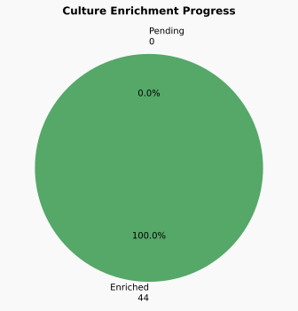

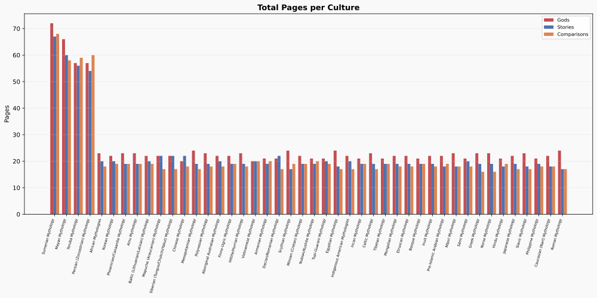

---

## 📈 分析覆蓋 / Analysis Coverage

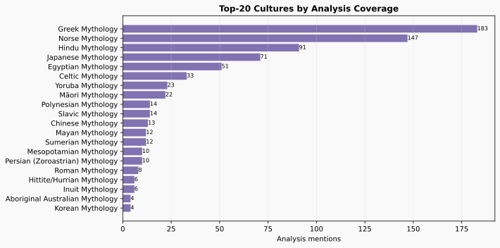

---

## 📡 各文化雷達圖 / Per-Culture Radar

五維度雷達圖：神祇頁面、故事頁面、比較頁面、充實狀態、分析提及次數。

| 文化 | 雷達圖 | 頁面總數 | 已充實 | 分析提及 |
|------|--------|---------|--------|---------|
| **蘇美神話** Sumerian Mythology | 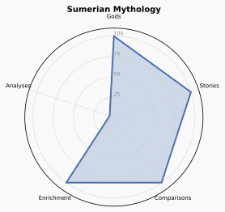 | 231 | ✅ | 13 |
| **馬雅神話** Mayan Mythology | 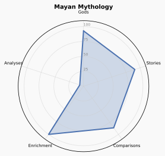 | 196 | ✅ | 13 |
| **波斯神話** Persian (Zoroastrian) Mythology | 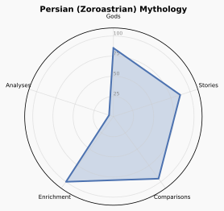 | 180 | ✅ | 11 |
| **約魯巴神話** Yoruba Mythology | 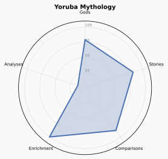 | 178 | ✅ | 25 |
| **斯基泰神話** Scythian Mythology |  | 72 | ✅ | 0 |
| **美索不達米亞神話** Mesopotamian Mythology | 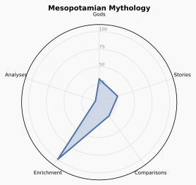 | 71 | ✅ | 11 |
| **波利尼西亞神話** Polynesian Mythology |  | 70 | ✅ | 18 |
| **非洲諸神話** African Mythologies |  | 70 | ✅ | 1 |
| **蒙古神話** Mongolian Mythology |  | 70 | ✅ | 4 |
| **埃及神話** Egyptian Mythology | 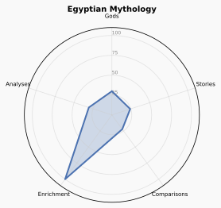 | 69 | ✅ | 57 |
| **芬蘭-烏戈爾神話** Finno-Ugric Mythology |  | 69 | ✅ | 1 |
| **赫梯神話** Hittite/Hurrian Mythology |  | 69 | ✅ | 7 |
| **伊特魯里亞神話** Etruscan Mythology | 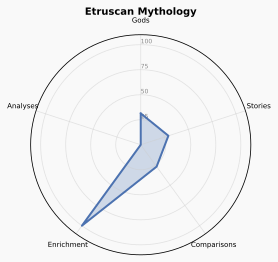 | 69 | ✅ | 0 |
| **越南神話** Vietnamese Mythology |  | 69 | ✅ | 2 |
| **亞美尼亞神話** Armenian Mythology | 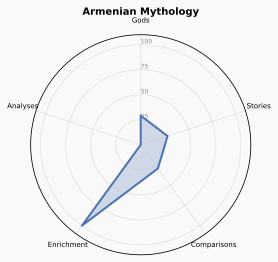 | 69 | ✅ | 0 |
| **米諾斯神話** Minoan (Cretan) Mythology |  | 69 | ✅ | 0 |
| **努比亞/庫什神話** Nubian/Kushite Mythology |  | 69 | ✅ | 0 |
| **中國上古神話** Chinese Mythology |  | 68 | ✅ | 14 |
| **印加神話** Incan Mythology |  | 68 | ✅ | 3 |
| **凱爾特神話** Celtic Mythology | 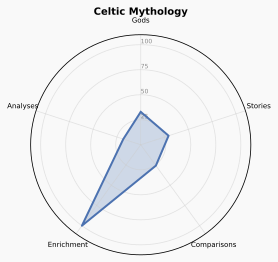 | 68 | ✅ | 34 |
| **西藏神話** Tibetan Mythology | 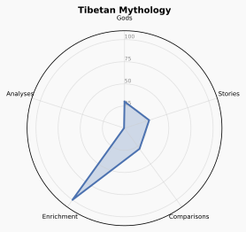 | 68 | ✅ | 1 |
| **巴斯克神話** Basque Mythology |  | 68 | ✅ | 1 |
| **因紐特神話** Inuit Mythology | 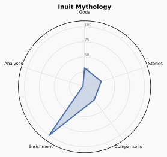 | 68 | ✅ | 7 |
| **高加索神話** Caucasian (Nart) Mythology | 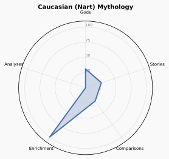 | 68 | ✅ | 0 |
| **羅馬神話** Roman Mythology |  | 68 | ✅ | 10 |
| **前伊斯蘭阿拉伯神話** Pre-Islamic Arabian Mythology | 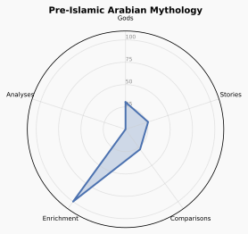 | 68 | ✅ | 0 |
| **薩米神話** Sámi Mythology |  | 68 | ✅ | 1 |
| **希臘神話** Greek Mythology | 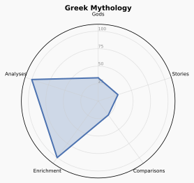 | 67 | ✅ | 206 |
| **北歐神話** Norse Mythology | 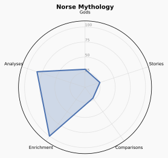 | 67 | ✅ | 163 |
| **印度神話** Hindu Mythology | 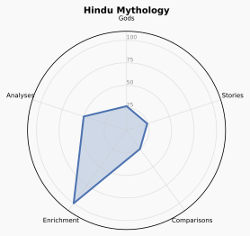 | 67 | ✅ | 101 |
| **日本神話** Japanese Mythology | 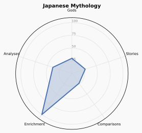 | 67 | ✅ | 79 |
| **美洲原住民神話** Indigenous American Mythologies |  | 67 | ✅ | 3 |
| **韓國神話** Korean Mythology |  | 67 | ✅ | 4 |
| **腓尼基神話** Phoenician/Canaanite Mythology | 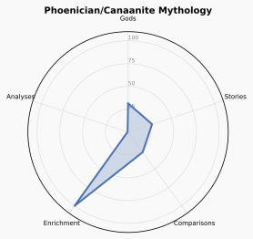 | 67 | ✅ | 1 |
| **愛努神話** Ainu Mythology | 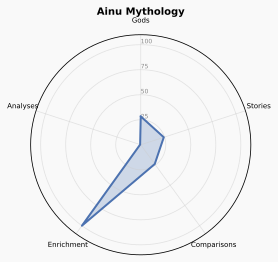 | 67 | ✅ | 1 |
| **波羅的神話** Baltic (Lithuanian/Latvian) Mythology | 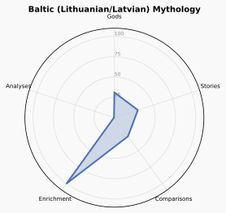 | 67 | ✅ | 1 |
| **菲律賓神話** Philippine Mythology |  | 67 | ✅ | 3 |
| **毛利神話** Māori Mythology | 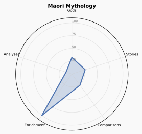 | 67 | ✅ | 23 |
| **馬普切神話** Mapuche (Araucanian) Mythology | 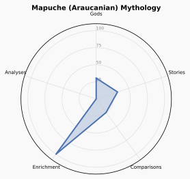 | 67 | ✅ | 0 |
| **西伯利亞神話** Siberian (Tungus/Chukchi/Yakut) Mythology | 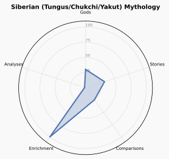 | 67 | ✅ | 4 |
| **澳洲原住民神話** Aboriginal Australian Mythology |  | 66 | ✅ | 4 |
| **斯拉夫神話** Slavic Mythology |  | 66 | ✅ | 15 |
| **達基亞/羅馬尼亞神話** Dacian/Romanian Mythology | 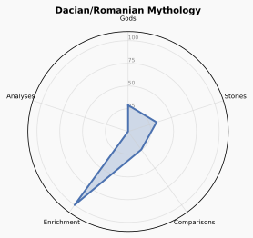 | 66 | ✅ | 0 |
| **圖皮-瓜拉尼神話** Tupi-Guarani Mythology |  | 66 | ✅ | 2 |

---

## 📊 各文化詳細指標 / Detailed Metrics

| Culture | Gods | Stories | Comps | Total | Enriched | Analyses | Depth |
|---------|------|---------|-------|-------|----------|----------|-------|
| 蘇美神話 (Sumerian Mythology) | 80 | 75 | 76 | 231 | Y | 13 | 12700 |
| 馬雅神話 (Mayan Mythology) | 70 | 64 | 62 | 196 | Y | 13 | 10981 |
| 波斯神話 (Persian (Zoroastrian) Mythology) | 60 | 57 | 63 | 180 | Y | 11 | 11437 |
| 約魯巴神話 (Yoruba Mythology) | 59 | 58 | 61 | 178 | Y | 25 | 9486 |
| 斯基泰神話 (Scythian Mythology) | 28 | 22 | 22 | 72 | Y | 0 | 4159 |
| 美索不達米亞神話 (Mesopotamian Mythology) | 29 | 22 | 20 | 71 | Y | 11 | 3344 |
| 波利尼西亞神話 (Polynesian Mythology) | 27 | 22 | 21 | 70 | Y | 18 | 4191 |
| 非洲諸神話 (African Mythologies) | 26 | 23 | 21 | 70 | Y | 1 | 3139 |
| 蒙古神話 (Mongolian Mythology) | 27 | 22 | 21 | 70 | Y | 4 | 3326 |
| 埃及神話 (Egyptian Mythology) | 28 | 20 | 21 | 69 | Y | 57 | 3759 |
| 芬蘭-烏戈爾神話 (Finno-Ugric Mythology) | 25 | 22 | 22 | 69 | Y | 1 | 3437 |
| 赫梯神話 (Hittite/Hurrian Mythology) | 26 | 22 | 21 | 69 | Y | 7 | 4029 |
| 伊特魯里亞神話 (Etruscan Mythology) | 26 | 22 | 21 | 69 | Y | 0 | 3701 |
| 越南神話 (Vietnamese Mythology) | 23 | 23 | 23 | 69 | Y | 2 | 3627 |
| 亞美尼亞神話 (Armenian Mythology) | 24 | 22 | 23 | 69 | Y | 0 | 3082 |
| 米諾斯神話 (Minoan (Cretan) Mythology) | 25 | 22 | 22 | 69 | Y | 0 | 4132 |
| 努比亞/庫什神話 (Nubian/Kushite Mythology) | 24 | 22 | 23 | 69 | Y | 0 | 3559 |
| 中國上古神話 (Chinese Mythology) | 23 | 24 | 21 | 68 | Y | 14 | 3493 |
| 印加神話 (Incan Mythology) | 24 | 22 | 22 | 68 | Y | 3 | 4429 |
| 凱爾特神話 (Celtic Mythology) | 26 | 22 | 20 | 68 | Y | 34 | 4339 |
| 西藏神話 (Tibetan Mythology) | 24 | 22 | 22 | 68 | Y | 1 | 3812 |
| 巴斯克神話 (Basque Mythology) | 24 | 22 | 22 | 68 | Y | 1 | 3465 |
| 因紐特神話 (Inuit Mythology) | 25 | 22 | 21 | 68 | Y | 7 | 3522 |
| 高加索神話 (Caucasian (Nart) Mythology) | 26 | 21 | 21 | 68 | Y | 0 | 3635 |
| 羅馬神話 (Roman Mythology) | 27 | 21 | 20 | 68 | Y | 10 | 3624 |
| 前伊斯蘭阿拉伯神話 (Pre-Islamic Arabian Mythology) | 25 | 21 | 22 | 68 | Y | 0 | 3135 |
| 薩米神話 (Sámi Mythology) | 24 | 23 | 21 | 68 | Y | 1 | 3235 |
| 希臘神話 (Greek Mythology) | 26 | 22 | 19 | 67 | Y | 206 | 3319 |
| 北歐神話 (Norse Mythology) | 26 | 22 | 19 | 67 | Y | 163 | 3658 |
| 印度神話 (Hindu Mythology) | 24 | 21 | 22 | 67 | Y | 101 | 3597 |
| 日本神話 (Japanese Mythology) | 25 | 22 | 20 | 67 | Y | 79 | 3345 |
| 美洲原住民神話 (Indigenous American Mythologies) | 25 | 23 | 19 | 67 | Y | 3 | 4607 |
| 韓國神話 (Korean Mythology) | 24 | 22 | 21 | 67 | Y | 4 | 3143 |
| 腓尼基神話 (Phoenician/Canaanite Mythology) | 25 | 21 | 21 | 67 | Y | 1 | 2815 |
| 愛努神話 (Ainu Mythology) | 25 | 21 | 21 | 67 | Y | 1 | 3280 |
| 波羅的神話 (Baltic (Lithuanian/Latvian) Mythology) | 24 | 22 | 21 | 67 | Y | 1 | 3214 |
| 菲律賓神話 (Philippine Mythology) | 24 | 22 | 21 | 67 | Y | 3 | 3503 |
| 毛利神話 (Māori Mythology) | 25 | 21 | 21 | 67 | Y | 23 | 3823 |
| 馬普切神話 (Mapuche (Araucanian) Mythology) | 24 | 24 | 19 | 67 | Y | 0 | 3404 |
| 西伯利亞神話 (Siberian (Tungus/Chukchi/Yakut) Mythology) | 24 | 24 | 19 | 67 | Y | 4 | 3664 |
| 澳洲原住民神話 (Aboriginal Australian Mythology) | 24 | 22 | 20 | 66 | Y | 4 | 3712 |
| 斯拉夫神話 (Slavic Mythology) | 26 | 20 | 20 | 66 | Y | 15 | 3448 |
| 達基亞/羅馬尼亞神話 (Dacian/Romanian Mythology) | 23 | 24 | 19 | 66 | Y | 0 | 3542 |
| 圖皮-瓜拉尼神話 (Tupi-Guarani Mythology) | 23 | 22 | 21 | 66 | Y | 2 | 3853 |

---
*Generated by `scripts/generate_stats.py` on 2026-09-28 11:00 UTC*
